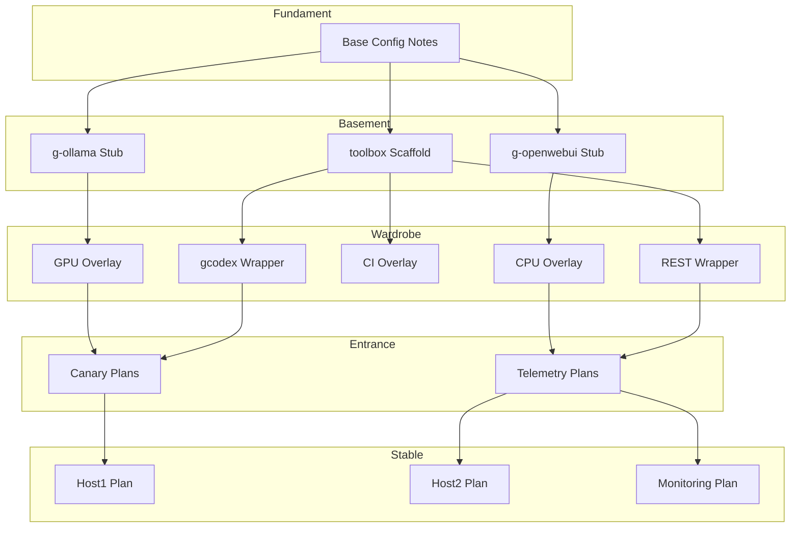

# House Architecture Scaffold

Die House-Metapher strukturiert unser Repository in klar getrennte Ebenen, damit jede Schicht eine definierte Verantwortung trägt und Übergänge nachvollziehbar bleiben.
Die tagesaktuelle Zusammenfassung steht in [revision-2025-09-28.md](revision-2025-09-28.md) und ergänzt die hier beschriebene Architektur um konkrete Aufgaben.

## Layer Roles
- **Fundament**: Verankert Basis-Setups, gemeinsame Netzwerke und Host-Anforderungen, bevor Services entstehen (nur Host-OS + Docker + Git).
- **Basement**: Beherbergt nackte Komponenten-Stubs wie Ollama, Open-WebUI sowie das Toolbox-Mono-Repo zur Verwaltung von Tools, Versionen und Projekten.
- **Wardrobe**: Stellt Überlagerungen, Verpackungen und Wrapper bereit (z. B. `basement/toolbox/bin/gcodex` für Codex-Chats) und bereitet Basement-Dienste für Tests vor.
- **Entrance**: Dient als Frontdoor für frühe Nutzerinteraktionen, Canaries und Telemetrieexperimente.
- **Stable**: Enthält freigegebene Produktions-Deployments sowie Monitoring- und Observability-Pfade.

### Abgleich mit aktuellen Planungsannahmen
- **Fundament** bleibt auf den Docker-Fokus reduziert: solange der Host zuverlässig Docker Desktop (bzw. passende Engine-Versionen auf anderen Plattformen) bereitstellt, kann jede weitere Schicht darauf aufbauen.
- **Basement** priorisiert eine möglichst hostnahe Ausführung der LLM-Läufe. Ollama bleibt daher auf dem Host installiert, während der Codex-CLI-Container sich nur als dünner Client verhält und per Shared Workspace (`./shared:/workspace`) Dateien austauscht.
- **Wardrobe** fungiert als „Suit Switcher“ zwischen unterschiedlichen Hosts. Overlays sollen sicherstellen, dass Sessions auf einem Windows/NVIDIA-System genauso starten wie auf dem macOS-Host, ohne Datenverluste oder manuelle Re-Konfiguration.
- **Entrance** und **Stable** behalten ihren Planungsstatus; spätere Dokumentationen verlinken auf spezifische Canary-/Telemetry- bzw. Produktionspfade, sobald die Wardrobe-Overlays gefestigt sind.

## Mermaid Overview

## Next Steps
- Siehe [../fundament/](../fundament/) für Host-Baselines (OS, Docker, Git) und Promotion-Notizen.
- Siehe [../basement/](../basement/) für Docker-Stubs der Kernkomponenten, das Toolbox-Skelett (`toolbox/`) und Wrapper wie `bin/gcodex`.
- Siehe [../basement/toolbox/inventories/](../basement/toolbox/inventories/) für Homebrew-/Tool-Listen.
- Siehe [../basement/toolbox/projects/toolbox/](../basement/toolbox/projects/toolbox/) für den Compose-Stack-Plan (Codex im Container, Ollama als Host-Service).
- Siehe [../wardrobe/](../wardrobe/) für geplante Overlays und Wrapper.
- Siehe [../entrance/](../entrance/) für Canary- und Telemetrie-Planflächen.
- Siehe [../stable/](../stable/) für Produktions-Skelette und Monitoring-Pläne.
