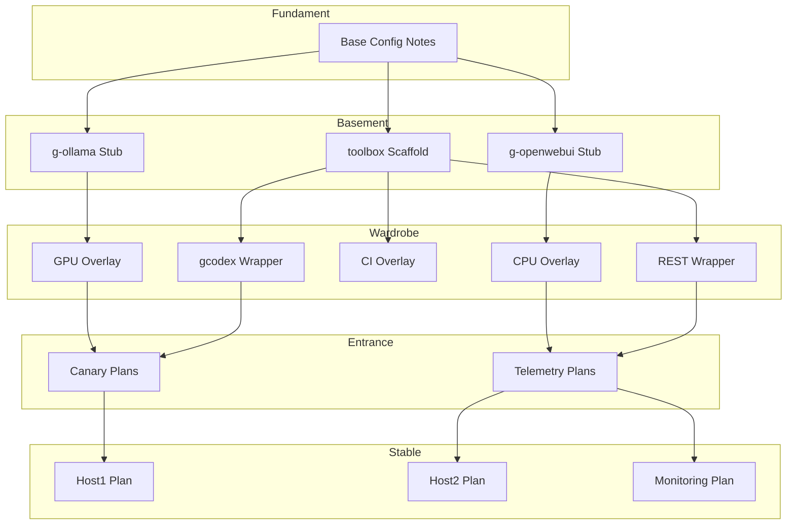

# House Architecture Scaffold

Die House-Metapher strukturiert unser Repository in klar getrennte Ebenen. Dieses Dokument bündelt nun sämtliche Referenzen auf README, Runbook, Security-Guides, das Whole-House-Compendium sowie den neuen Compliance-Audit, damit jede Ebene konsistent dokumentiert bleibt.

- **Primärer Überblick**: [`README.md`](../README.md) enthält die Repository-Atlas-Tabelle, Quickstart-Anweisungen und Konsolidierungs-Roadmap.
- **Navigator**: [`docs/project-compendium.md`](project-compendium.md) liefert Kapitel-Legenden, Personas und direkte Links je Ebene.
- **Betrieb & Automatisierung**: [`RUNBOOK.md`](../RUNBOOK.md) verweist auf alle Makefile-Ziele und beschreibt Incident-, Backup- und Restore-Abläufe.
- **Sicherheitskontrollen**: [`SECURITY.md`](../SECURITY.md) definiert Bedrohungsmodell und Maßnahmen; Scores stehen in [`docs/audit-matrix.md`](audit-matrix.md).
- **Planungsstand**: [`revision-2025-09-28.md`](revision-2025-09-28.md) dokumentiert offene Aufgaben je Layer.

## Layer Roles
- **Fundament**: Verankert Basis-Setups, gemeinsame Netzwerke und Host-Anforderungen (nur Host-OS + Docker + Git). Siehe [`fundament/`](../fundament/).
- **Basement**: Beherbergt Stubs für Ollama, OpenWebUI sowie das Toolbox-Monorepo zur Verwaltung von Tools, Versionen und Projekten. Siehe [`basement/`](../basement/) und `toolbox/`-Unterordner.
- **Wardrobe**: Stellt Overlays (CPU/GPU/CI) und Wrapper (`bin/gcodex`) bereit und gleicht Host-Unterschiede aus. Siehe [`wardrobe/`](../wardrobe/).
- **Entrance**: Dient als Frontdoor für frühe Nutzerinteraktionen, Canaries und Telemetrieexperimente. Siehe [`entrance/`](../entrance/).
- **Stable**: Enthält Produktions-Deployments, Monitoring-Pläne und Promotion-Gates. Siehe [`stable/`](../stable/).

### Abgleich mit aktuellen Planungsannahmen
- **Fundament** bleibt Docker-zentriert, solange Host und Devcontainer identische Engine-Versionen nutzen. Abhängigkeiten werden in [`fundament/versions.yaml`](../fundament/versions.yaml) gespiegelt.
- **Basement** priorisiert hostnahe LLM-Läufe; Codex-CLI-Container agiert als dünner Client gegen Host-Ollama. Entscheidungen werden in [`docs/audit-matrix.md`](audit-matrix.md) unter „Local Execution“ bewertet.
- **Wardrobe** fungiert als „Suit Switcher“ zwischen Windows/NVIDIA und macOS. Fortschritte sind in [`revision-2025-09-28.md`](revision-2025-09-28.md) unter „Wardrobe“ gelistet.
- **Entrance** und **Stable** behalten ihren Planungsstatus; künftige Promotions sollen Doppelstrukturen vermeiden, indem sie README-Roadmap und Audit-Scores gemeinsam aktualisieren.

## Mermaid Overview

## Konsolidierungsfahrplan
- **Dokumentenfusion**: README (Atlas) + dieses Architektur-Dokument sollen mittelfristig in einer kombinierten „Architecture & Roadmap“-Seite aufgehen. Bis dahin verweist README auf diese Datei als Detailquelle.
- **Redundanzprüfung**: Planungsdetails aus `revision-2025-09-28.md` sollten nach Abschluss einzelner Aufgaben hierher oder in die README-Roadmap migriert werden.
- **Audit-Referenzen**: Jeder neue Kontrollpunkt muss sowohl in `SECURITY.md` als auch in `docs/audit-matrix.md` auftauchen; Linkpflege erfolgt hier.
- **Layer-Promotions**: Sobald Wardrobe-Overlays produktionsreif sind, werden Entrance-/Stable-Platzhalter reduziert oder mit Compose-Profilen verschmolzen (vgl. README „Change Management & Consolidation“).
