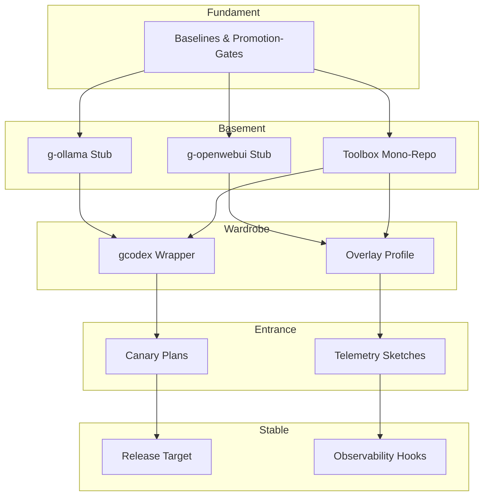

# House Blueprint

Der Blueprint beschreibt die Architektur des Repositories und erklärt, wie sich
alle Ebenen des Hauses gegenseitig ergänzen. Die Toolbox bildet dabei den ersten
festen Bewohner im Basement und verbindet Host-Ressourcen mit zukünftigen
Bewohnern in Wardrobe, Entrance und Stable.

Aktuelle Tagesplanung und Entscheidungen werden im [Logbuch](../logbook/README.md)
festgehalten. Der Blueprint dient als statischer Referenzrahmen.

## Layer im Überblick
- **Fundament** – Host-Baselines, Versionslisten und Promotionskelette. Diese
  Ebene stellt sicher, dass Docker, Git und Netzwerke bereitstehen, bevor
  irgendein Service anläuft.
- **Basement** – Stagingfläche für Dienste und Projekte. Derzeit lebt hier die
  Toolbox mitsamt `g-ollama` und `g-openwebui` Stubs. Sie verwaltet Kataloge,
  Compose-Entwürfe und Inventare und fungiert als Drehscheibe in Richtung der
  oberen Ebenen.
- **Wardrobe** – Overlays, Wrapper und Laufzeitprofile. Die Toolbox liefert
  hierzu Referenz-Skripte (`bin/gcodex`) und definiert welche Artefakte später in
  die Wardrobe promotet werden.
- **Entrance** – Canary- und Telemetrie-Fläche. Sobald die Toolbox stabile
  Workflows bietet, werden hier erste Nutzerflüsse simuliert.
- **Stable** – Produktionsziel des Hauses. Promotion-Gates aus Fundament und
  Basement müssen erfüllt sein, bevor Projekte diesen Bereich belegen.

## Toolbox im Kontext
Die Toolbox ist mehr als ein einzelnes Projekt: Sie stellt Verzeichnisse,
Kataloge und Automationsentwürfe bereit, die jede weitere Bewohnerin des Hauses
nutzen wird. Schlüsselkomponenten:

- `basement/toolbox/projects/toolbox/` dokumentiert den Codex/Ollama Stack.
- `basement/toolbox/bin/gcodex` fungiert als Wardrobe-tauglicher Wrapper.
- `basement/toolbox/inventories/` speichert wiederverwendbare Paketlisten.
- `basement/toolbox/docs/` enthält Standards, Playbooks und Diagrams, auf die
  höhere Ebenen verweisen.

Solange keine anderen Projekte eingezogen sind, bleibt die Toolbox Referenz für
Benennung, Promotion und Dokumentation. Neue Initiativen sollten im Blueprint
mit eigenen Knoten ergänzt werden und ein Projektdossier unter `docs/projects/`
erhalten.

## Mermaid-Diagramm

## Navigationshinweise
- Host-Anforderungen und Promotion-Regeln: [`fundament/`](../../fundament/)
- Toolbox-Dossier: [`docs/projects/toolbox.md`](../projects/toolbox.md)
- Compose- und Serviceentwürfe: [`basement/toolbox/`](../../basement/toolbox/)
- Überlagerungen & Wrapper: [`wardrobe/`](../../wardrobe/)
- Canary- und Produktionspfade: [`entrance/`](../../entrance/),
  [`stable/`](../../stable/)

## Roadmap
1. Wardrobe-Overlays konkretisieren, basierend auf den Toolbox-Referenzen.
2. Entrance-Experimente mit echten Codex/Ollama-Workflows vorbereiten, sobald
   Shared-Workspace-Prozesse getestet wurden.
3. Stable-Gates definieren und mit Fundament-Promotions verknüpfen.
4. Weitere Projekte (z. B. Telemetrie-Gateway) in den Blueprint aufnehmen und
   mit eigenen Dossiers dokumentieren.
